# Usage
## For students & teachers
- To view the bus schedule for today, go to [insert given server's name here]:80/home in the browser (ex: busapp:80/home)
  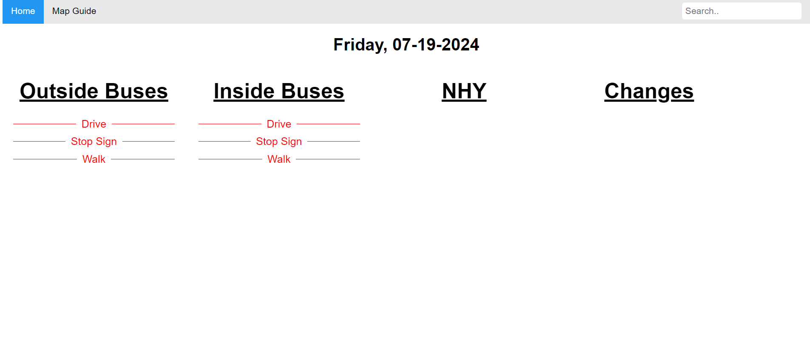
- For freshmen and students who do not know how the bus positions work, go to Map Guide tab in the top left
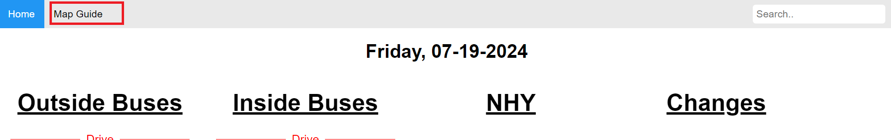
- If the students need to look for their buses, go to the search bar in the top right and enter their bus route. It should then be highlighted in the page.
>[!NOTE]
>Only the schedule from today will be shown, you cannot see schedules from other days.
---
# Requirements
- Nodejs
- npm
- SQL Server
# Deploying & Hosting with Docker (for testing and production purposes only)
## Section 1: Database

>[!NOTE]
>Create a table called Accounts (drop table first if Accounts already exists) with username and password columns with the script below:
```sql
USE [BusDismissal]
GO

/****** Object:  Table [dbo].[Accounts]    Script Date: 4/23/2024 5:45:35 PM ******/
SET ANSI_NULLS ON
GO

SET QUOTED_IDENTIFIER ON
GO
/* Uncomment the DROP TABLE below if Accounts already exist */
/* DROP TABLE Accounts; */
CREATE TABLE [dbo].[Accounts](
	[id] [int] IDENTITY(1,1) NOT NULL,
	[username] [varchar](255) NULL,
	[password] [varchar](255) NULL,
PRIMARY KEY CLUSTERED 
(
	[id] ASC
)WITH (PAD_INDEX = OFF, STATISTICS_NORECOMPUTE = OFF, IGNORE_DUP_KEY = OFF, ALLOW_ROW_LOCKS = ON, ALLOW_PAGE_LOCKS = ON) ON [PRIMARY]
) ON [PRIMARY]
GO
```
## Section 2: Required files
1. Download [compose.yaml](compose.yaml)
2. .env file (from email)
3. Put them in a folder together
## Section 3: Docker
1. Launch Docker Desktop app on computer to make sure it's running
2. Launch Cmd Prompt/Terminal and navigate to where the folder from Section 2 Step 3 is located
3. Type in:
```batch
docker-compose pull
```
1. Enter to let it pull from the Docker Hub
2. Once it's done pulling and 'Pull complete' is displayed, run this to start the app:
```batch
docker-compose up
```
1. Verify 'Server listening on PORT 80' is displayed on terminal
2. Navigate to localhost:80/admin from the browser to get to the Admin page of the app
3. Default login:
        username: busAdmin
        password: busAdmin
4. Change credentials after logging in by going to the Accounts tab on the navigation bar up top.
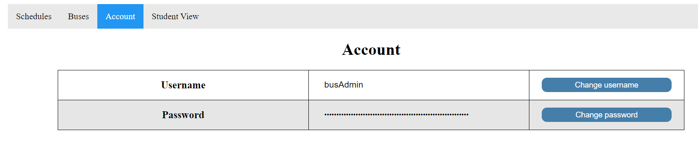
# Development Setup
>[!NOTE]
> Local admin rights required on computer in order to install SQL server
## SQL Server Setup
### Installation
>[!NOTE]
>If you're using MacOS, you will have to install SQL Server with Docker, go to [this section](#macos-and-linux)
#### Windows
1. Install SQL Server Express [here](https://www.microsoft.com/en-us/download/details.aspx?id=55994)
2. Run the installer and choose the custom option
3. Install and choose "New SQL Server stand-alone installation"
4. Go through installer until the Instance Configuration section, rename the instance and change its ID if desired, default is SQLEXPRESS
5. For Database Engine Configuration, choose Mixed Mode and set up sa account
>[!IMPORTANT]
>On SSMS, the hostname is localhost\SQLEXPRESS, but on other DBMS interfaces, the hostname might be only localhost instead. The default port is 1433
#### MacOS and Linux
1. Install Docker Desktop and launch it
2. Download [docker-compose file](Documentation/docker-compose.yaml)
3. Change SA_PASSWORD if you want to change the default password for SA account
>[!NOTE]
>If you're on Linux, add user attribute to the yaml file with the username that owns the directory where the volume is mounted
``` docker-compose
services:
  sqlserver:
    user: root # add this line
    image: mcr.microsoft.com/mssql/server
    container_name: MsSqlServer
    environment:
     - ACCEPT_EULA=Y
     - SA_PASSWORD=Room#176
    ports:
     - "1433:1433"
    volumes:
     - ./mssql-data:/var/opt/mssql/data
```
5. Open terminal in the folder where the docker-compose file is located
6. Run `docker-compose up -d`
7. The process should now show up on the list of containers in Docker Desktop or if you're on Linux run `sudo docker ps` to show a list of running containers
8. Access
### Setup
>[!NOTE]
>Configuration with SQL Server Configuration Manager is only relevant to Windows installation
1. Open Sql Server Configuration Manager
>[!NOTE]
>If SQL Server Configuration Manager is not found, follow the steps in this [link](https://learn.microsoft.com/en-us/answers/questions/166724/sql-server-configuration-manager-not-showing-in-wi)
1. Enable SQL Server Browser in the SQL Server Services section by Right-click to Properties, Service, and change Start Mode to Automatic. Apply changes.
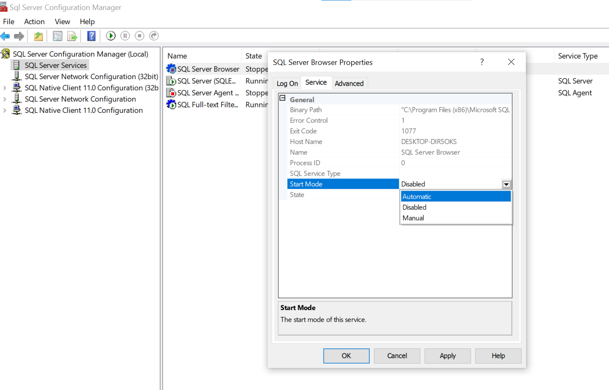
1. Right-click SQL Server Browser and select Start
2. Expand SQL Server Network Configuration and select Protocols for [Instance name] (default is SQLEXPRESS)
3. Right-click and enable TCP/IP
4. Navigate to SQL Server Services and restart SQL Server that is currently running
### Access & Initialize database
1. Install [SQL Server Management Studio (SSMS)](https://learn.microsoft.com/en-us/sql/ssms/download-sql-server-management-studio-ssms?view=sql-server-ver16) (MacOS not supported), [Beekeeper Studio (Community Edition)](https://www.beekeeperstudio.io/get-community), or [Azure Data Studio](https://learn.microsoft.com/en-us/azure-data-studio/download-azure-data-studio?tabs=win-install%2Cwin-user-install%2Credhat-install%2Cwindows-uninstall%2Credhat-uninstall) (most similar to SSMS but supports MacOS), or any other DBMS interface of your liking that supports SQL Server
2. Connect to server on SQL Server Management Studio with either Windows authentication or sa credentials made during server installation. If you did not specify any other usernames, it would be 'sa' and whatever password you set
3. Select New Query and execute the script from [scripts file](scripts.txt) to create database and tables

## Setup project's folder
1. Install git [here](https://git-scm.com/downloads) or Github Desktop [here](https://docs.github.com/en/desktop/installing-and-authenticating-to-github-desktop/installing-github-desktop) if you want to use the interface instead
2. Clone the repo
    - If you use git, open Cmd Prompt/Terminal in the folder that you want to store the project, run `git clone https://github.com/lily10806/ATCBusApp.git`.
    - If you use Github Desktop, go to File, and choose Clone Repository
    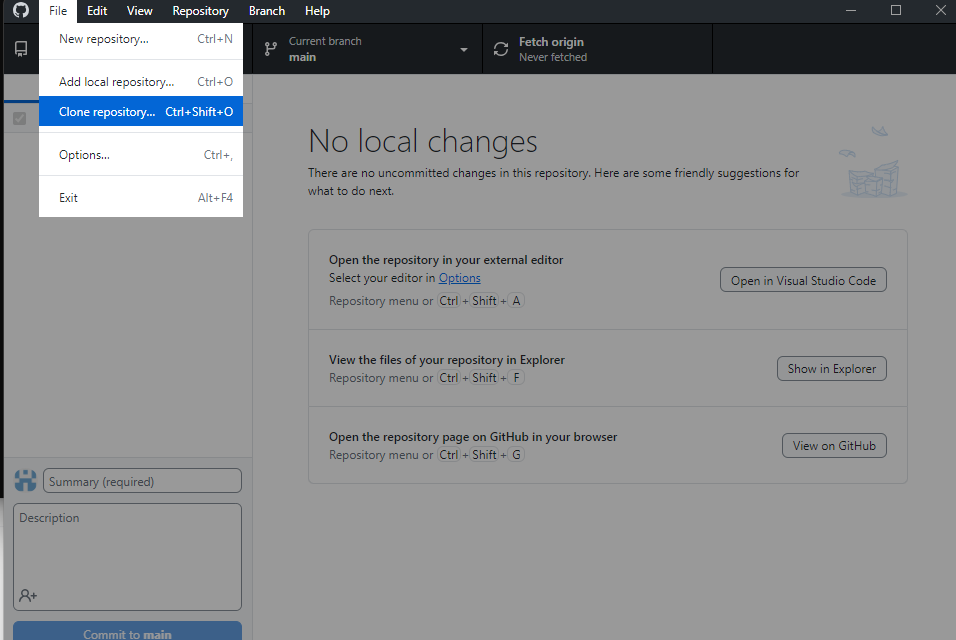
    Paste the link https://github.com/lily10806/ATCBusApp.git into the URL for the repository, and choose which local path you want it cloned to and clone the repo.
    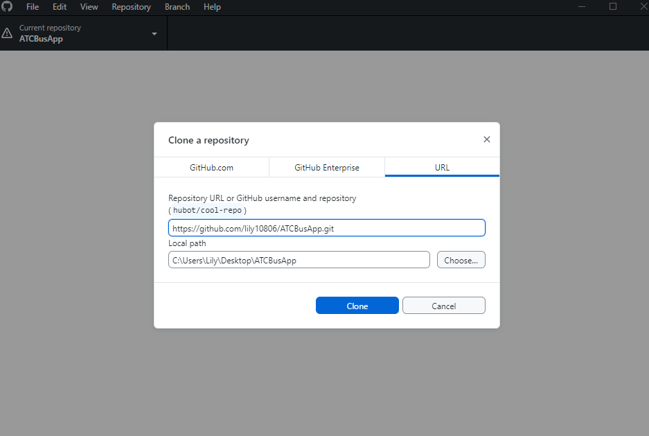
3. Create a .env file at the root of the project and copy the contents of [example.env](Documentation/example.env) into the .env file. Change the environmental variables as needed (create a secret key & session secret, generate a aes256 secret key)
## Setting up Node.js
1. Install nvm
    - [Windows Installer](https://github.com/coreybutler/nvm-windows/releases)
    - [macOS & Linux](https://github.com/nvm-sh/nvm?tab=readme-ov-file#installing-and-updating)
2. Install node with `nvm install node` and run `nvm use node`
3. Open Cmd Prompt/Terminal in project's directory and run `npm install` to install dependencies
4. [Optional] Once all packages are installed, run `npm install nodemon` to install nodemon (it refreshes the server automatically upon changes so you don't have to manually restart the server everytime)
## How to get the app running
1. Navigate to the project's folder in Cmd Prompt/Terminal
2. Run `node server.js` to start the app OR `nodemon server.js` if you have nodemon installed (if nodemon is not recognized right after installing it, try restarting Cmd Prompt/Terminal)
## Making changes to the repo (upload changes and getting changes from GitHub)
- Create a new branch
  - git: `git branch new-branch-name`
  - GitHub Desktop: Select branch > New branch, name the new branch and Create branch. If you've made changes to the files and want to have them on the new branch, choose 'Bring my changes to [new-branch]' and switch branch
  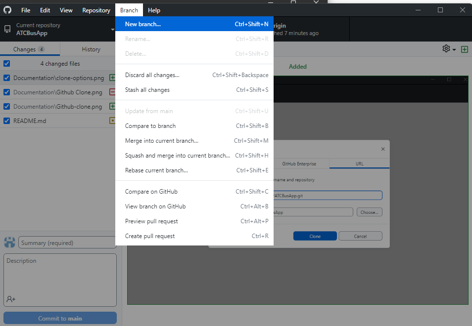
- Change to another branch (Be sure to work in a new branch so any unchecked changes won't be committed to the main branch)
>[!IMPORTANT]
>Always commit changes to current branch if you don't intend on bringing the uncommitted changes to the new branch to avoid any work loss. Checkout git stash to learn more about putting away local changes.
  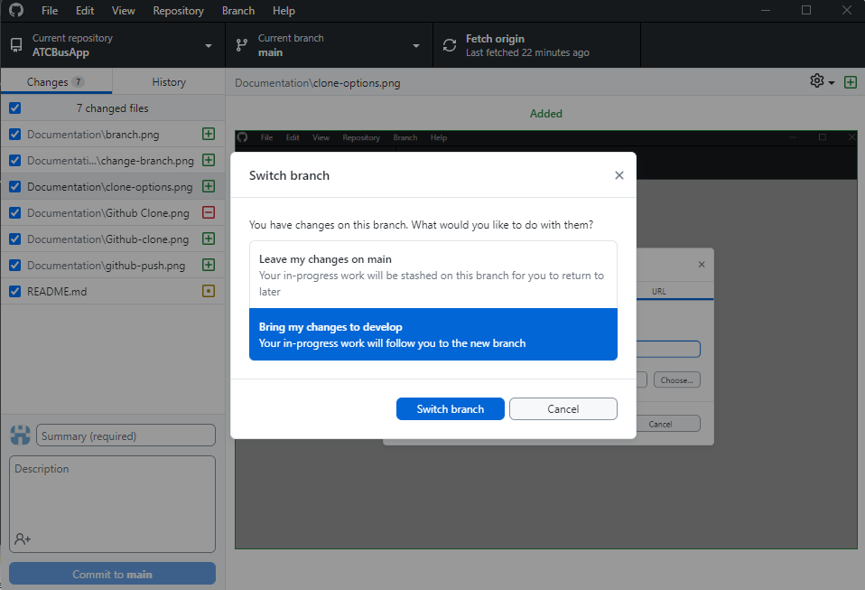
  - git: `git checkout branch-name`
  - GitHub Desktop: Select Current branch tab and change to another branch. Choose whether you want to move uncommitted changes to the new branch or not if prompted.
  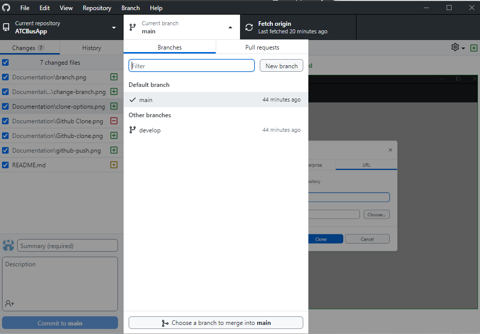
- Push changes to remote repo
  - git:
    1. `git add .` to add all files with changes
    2. `git commit -m "describe the changes you make here"`
    3. `git push origin` to push the changes to repo
  - GitHub Desktop:
    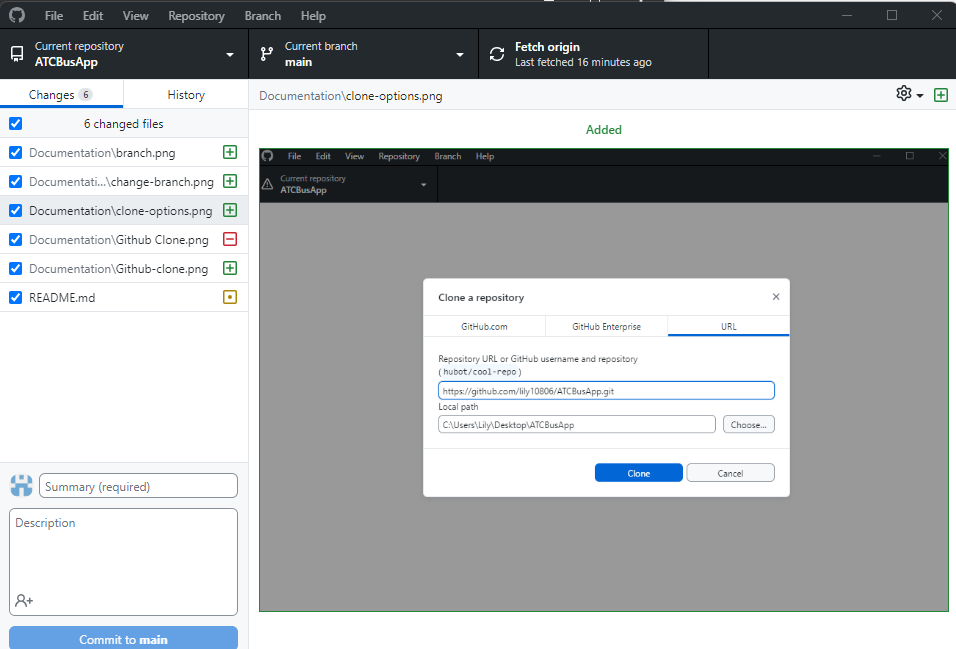
    1. Check the boxes for files you want to upload (on left sidebar)
    2. Write a summary for the changes you made
    3. Commit to branch
- Get remote changes from branch to local repo (For when you make changes to a branch from another device and want to get that change on this device)
  - git: `git pull origin branch-name-you-want-to-pull-from`
  - GitHub Desktop: 
    - Fetch origin to check for commits
    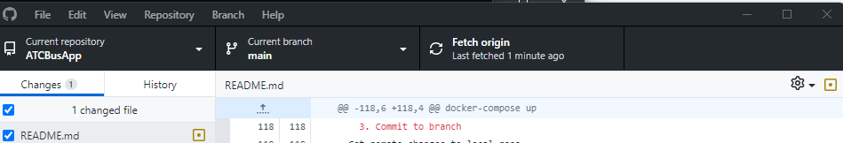
    - Pull origin to get changes from remote branch to local branch
    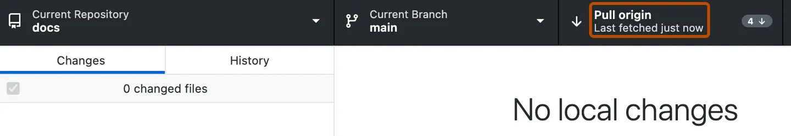
# Roadmap
- [ ] LDAP or OAuth authentication for admin and remove body-parser module
- [ ] Horizontal slide view on mobile
- [ ] Revamp drag-drop functionality to use Muuri library
