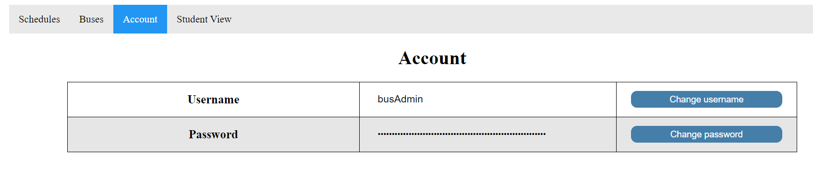
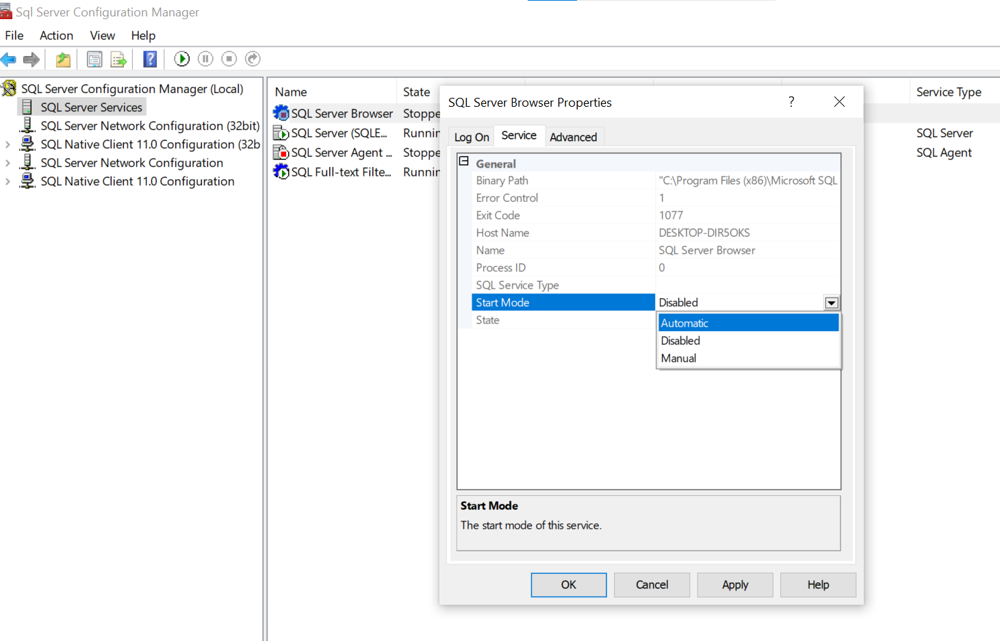

# Requirements
- Nodejs
- npm
- SQL Server
# Install bus app on server with Docker
## Section 1: Database
>[!NOTE]
>Create a table called Accounts (drop table first if Accounts already exists) with username and password columns with the script below:
```sql
USE [BusDismissal]
GO

/****** Object:  Table [dbo].[Accounts]    Script Date: 4/23/2024 5:45:35 PM ******/
SET ANSI_NULLS ON
GO

SET QUOTED_IDENTIFIER ON
GO
/* Uncomment the DROP TABLE below if Accounts already exist */
/* DROP TABLE Accounts; */
CREATE TABLE [dbo].[Accounts](
	[id] [int] IDENTITY(1,1) NOT NULL,
	[username] [varchar](255) NULL,
	[password] [varchar](255) NULL,
PRIMARY KEY CLUSTERED 
(
	[id] ASC
)WITH (PAD_INDEX = OFF, STATISTICS_NORECOMPUTE = OFF, IGNORE_DUP_KEY = OFF, ALLOW_ROW_LOCKS = ON, ALLOW_PAGE_LOCKS = ON) ON [PRIMARY]
) ON [PRIMARY]
GO
```
## Section 2: Required files
1. Download [compose.yaml](compose.yaml)
2. .env file (from email)
3. Put them in a folder together
## Section 3: Docker
1. Launch Docker Desktop app on computer to make sure it's running
2. Launch Cmd Prompt and navigate to where the folder from Section 2 Step 3 is located
3. Type in:
```batch
docker-compose pull
```
1. Enter to let it pull from the Docker Hub
2. Once it's done pulling and 'Pull complete' is displayed, run this to start the app:
```batch
docker-compose up
```
1. Verify 'Server listening on PORT 80' is displayed on terminal
2. Navigate to localhost:80/admin from the browser to get to the Admin page of the app
3. Default login:
        username: busAdmin
        password: busAdmin
4. Change credentials after logging in by going to the Accounts tab on the navigation bar up top.

# Setting up local SQL server for development
>[!NOTE]
> Local admin rights required on computer in order to install SQL server
## Installation
1. Install SQL Server Express [here](https://www.microsoft.com/en-us/download/details.aspx?id=55994)
2. Run the installer and choose the custom option
3. Install and choose "New SQL Server stand-alone installation"
4. Go through installer until the Instance Configuration section, rename the instance and change its ID if desired, default is SQLEXPRESS
5. For Database Engine Configuration, choose Mixed Mode and set up sa account
6. Install [SQL Server Management Studio (SSMS)](https://learn.microsoft.com/en-us/sql/ssms/download-sql-server-management-studio-ssms?view=sql-server-ver16), [Beekeeper Studio (Community Edition)](https://www.beekeeperstudio.io/get-community), or [HeidiSQL](https://www.heidisql.com/download.php?download), or any other DBMS interface of your liking that supports SQL Server
## Setup
1. Open Sql Server Configuration Manager
>[!NOTE]
>If SQL Server Configuration Manager is not found, follow the steps in this [link](https://learn.microsoft.com/en-us/answers/questions/166724/sql-server-configuration-manager-not-showing-in-wi)
2. Enable SQL Server Browser in the SQL Server Services section by Right-click to Properties, Service, and change Start Mode to Automatic. Apply changes.

1. Right-click SQL Server Browser and select Start
2. Expand SQL Server Network Configuration and select Protocols for [Instance name] (default is SQLEXPRESS)
3. Right-click and enable TCP/IP
4. Navigate to SQL Server Services and restart SQL Server that is currently running
5. Connect to server on SQL Server Management Studio with either Windows authentication or sa credentials made during server installation
6. Select New Query and execute the script from [scripts file](scripts.txt) to create database and tables
# Setting up Node.js
1. Install nvm
    - [Windows Installer](https://github.com/coreybutler/nvm-windows/releases)
    - [macOS & Linux](https://github.com/nvm-sh/nvm?tab=readme-ov-file#installing-and-updating)
2. Install node with `nvm install node` and run `nvm use node`
3. Open Cmd prompt in project's directory and run `npm install` to install dependencies
4. [Optional] Once all packages installed, run `npm install nodemon` to install nodemon (it refreshes the server automatically upon changes so you don't have to manually restart the server everytime)
# How to get the app running
1. Navigate to the project's folder in Cmd prompt
2. Run `node server.js` to start the app OR `nodemon server.js` if you have nodemon installed (if nodemon is not recognized right after installing it, try restarting Cmd Prompt)
